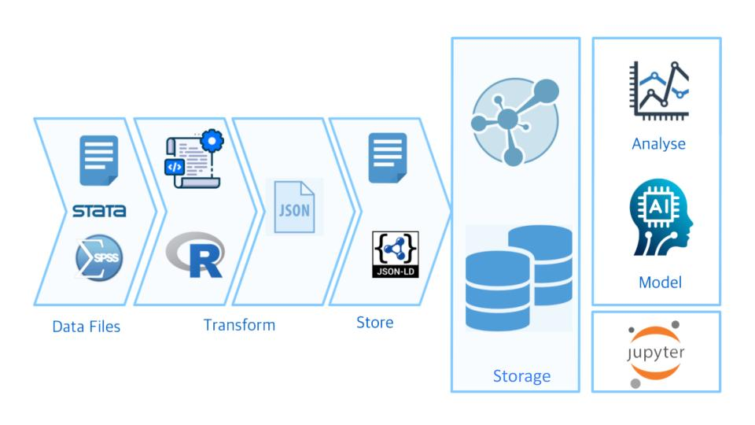
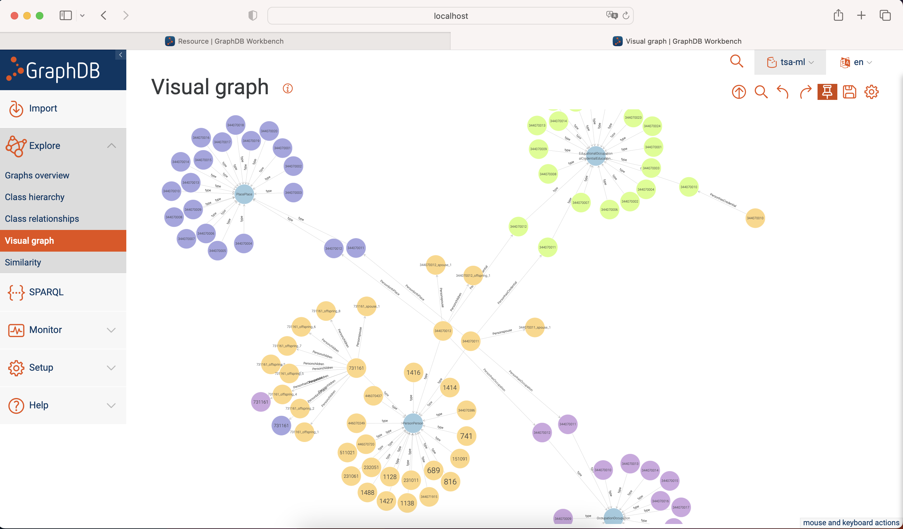

# TSA-ML

TSA-ML is a data platform that integrates data from diverse sources. This piece of work demostrates the use of  machine learning and data science in the region.

---



TSA-ML is a data pipeline that...

* **Transforms and ingest** consumer data from surveys drawn from diverse sources, mainly in the East-Asia region. It provides granular data at the level of the individual which allows powerful analytics and predictions.

* **Links** different sources using Resource Description Framework (RDF) and SPARQL W3C standards. Data is stored in a graph database, and data is interconnected using the Schema.org vocabulary.

* **Automates** the data preprocessing phase using Natural Language Processing (NLP), machine learning, and AI.

## Public datasets

Below is a list of the datasets currently used in the system.

| Region | Source | Owner | Description | Link
|:------|:-----------------|:--------------|:----------------------------------|:--------------|
| Taiwan |  Taiwan Social Change Survey (TSCS) | Center for Survey Research, Academia Sinica | A longitutindal dataset containing survey data on different social topics such as employment, family, and social networks. The TSCS contains data from the 1980's from individuals and families across Taiwan. | [Link](https://www2.ios.sinica.edu.tw/sc/en/home2.php)
| Taiwan |  World Values Survey (WVS) | Research Center for Humanities and Social Sciences, Academia Sinica, Taipei | Social surveys conducted in 2019, 2012, 2006, and 1998 | [Link](https://www.worldvaluessurvey.org/WVSDocumentationWV7.jsp) 
| Hong Kong |  World Values Survey (WVS) | Department of Government and International Studies, Hong Kong Baptist University | Social surveys conducted in 2018, 2014, and 2005 | [Link](https://www.worldvaluessurvey.org/WVSDocumentationWV7.jsp)
| Macao | World Values Survey (WVS) | Faculty of Social Sciences, Avenida da Universidade | Social surveys conducted in 2019 | [Link](https://www.worldvaluessurvey.org/WVSDocumentationWV7.jsp)
| China |  World Values Survey (WVS) | Public Opinion Research Center of School of International and Public Affairs at Shanghai Jiao Tong University | Social surveys conducted in 2018, 2013, 2007, 2001, 1995, and 1990 | [Link](https://www.worldvaluessurvey.org/WVSDocumentationWV7.jsp)

Please contact us if you want to contribute a dataset. Refer to the below details.

## Quick Start

### Requirements and Installation

Need to install the following in your environment:

* Python 3.9.6
* R version 4.2.3
* GraphDB 10.3.1

### What is in this repository?

This repository contains the following:

* JSON-LD ingestion files for graph database (`./ingestion/`).
* Landing web page for this work.

### Setup graph database

Install and activate virtual environment for TSA-ML graph database.

```
$ python3 -m venv tsaml
$ source tsaml/bin/activate
```

Start up GraphDB database instance.

```
$ sudo systemctl daemon-reload
$ sudo systemctl start graphdb
```

To stop and restart GraphDB database instance.

```
$ sudo systemctl stop graphdb
$ sudo systemctl restart graphdb
$ sudo systemctl status graphdb
$ sudo systemctl enable graphdb
$ journalctl -u graphdb
```

## Data Ingestion

### Uploading the data in the graph database

Graph database can ingest TSA-ML data using a custom developed shell script. Data files for ingestion are located in a directory on the local or remote machine which also contains the GraphDB installation and instance. A GraphDB repository needs to be setup under the name `tsa-ml`, including all of the necessary Schema.org namespaces. A directory needs to be setup on the local or remote machine. This directory contains all of the JSON data files.

```
$ sudo mkdir ~/tsaml_graphdb_ingest
$ sudo chown -R graphdbuser ~/tsaml_graphdb_ingest/
$ sudo chgrp graphdbuser ~/tsaml_graphdb_ingest/
```

Before executing the endpoint for ingesting JSON data files into GraphDB, need to change the `$JAVA` environmental variable in `/Applications/GraphDB Desktop.app/Contents/app/bin/setvars.in.sh` to include the following line `JAVA="/Applications/GraphDB Desktop.app/Contents/runtime/Contents/Home/bin/java"`. Copy `ingest_json_graphdb.sh` and `tsal-ml-config.ttl` file to Home directory of remote and local machine to execute `importrdf`. Below is a copy of the GraphDB configuration file (.ttl).

```
#
# RDF4J configuration template for a GraphDB repository
#
@prefix rdfs: <http://www.w3.org/2000/01/rdf-schema#>.
@prefix rep: <http://www.openrdf.org/config/repository#>.
@prefix sr: <http://www.openrdf.org/config/repository/sail#>.
@prefix sail: <http://www.openrdf.org/config/sail#>.
@prefix graphdb: <http://www.ontotext.com/config/graphdb#>.

[] a rep:Repository ;
    rep:repositoryID "tsa-ml" ;
    rdfs:label "TSA-ML project" ;
    rep:repositoryImpl [
        rep:repositoryType "graphdb:SailRepository" ;
        sr:sailImpl [
            sail:sailType "graphdb:Sail" ;

            graphdb:read-only "false" ;

            # Inference and Validation
            graphdb:ruleset "rdfsplus-optimized" ;
            graphdb:disable-sameAs "true" ;
            graphdb:check-for-inconsistencies "false" ;

            # Indexing
            graphdb:entity-id-size "32" ;
            graphdb:enable-context-index "false" ;
            graphdb:enablePredicateList "true" ;
            graphdb:enable-fts-index "false" ;
            graphdb:fts-indexes ("default" "iri") ;
            graphdb:fts-string-literals-index "default" ;
            graphdb:fts-iris-index "none" ;

            # Queries and Updates
            graphdb:query-timeout "0" ;
            graphdb:throw-QueryEvaluationException-on-timeout "false" ;
            graphdb:query-limit-results "0" ;

            # Settable in the file but otherwise hidden in the UI and in the RDF4J console
            graphdb:base-URL "http://example.org/owlim#" ;
            graphdb:defaultNS "" ;
            graphdb:imports "" ;
            graphdb:repository-type "file-repository" ;
            graphdb:storage-folder "storage" ;
            graphdb:entity-index-size "10000000" ;
            graphdb:in-memory-literal-properties "true" ;
            graphdb:enable-literal-index "true" ;
        ]
    ].
```

Data can also be ingested using the shell script called `ingest_json_graphdb.sh` (see below help documentation).

```
Usage: TSA-ML endpoint for GraphDB import JSON-LD/RDF files.

Syntax: bash ingest_json_graphdb.sh [-h|r|c|g|i|f]
options:
h     Help document for endpoint.
r     Folder containing RDF files for import.
c     Convert *.json to *.jsonld (y|n).
g     GraphDB importrdf directory.
i     GraphDB repository name.
f     GraphDB repository configuration file.
```

To execute the shell script use the following command prompt.
```
$  bash ingest_json_graphdb.sh
  -r ~/tsaml_graphdb_ingest/
  -c Y
  -g /Applications/GraphDB\ Desktop.app/Contents/app/bin/importrdf
  -i tsa-ml
  -f ~/tsa-ml-config.ttl
```

Data processing can take some time, as there are 2,395,151 statements. 

### Testing data

Data for TSA-ML can be explore using GraphDB Visual graph feature. Make sure Autocomplete index is built before the graph is created.



## Contact

Please email your questions or comments to (d01520417@gmail.com).

## Contributing

Thanks for your interest in contributing! There are many ways to get involved; start by sending us an email to the above email address.
