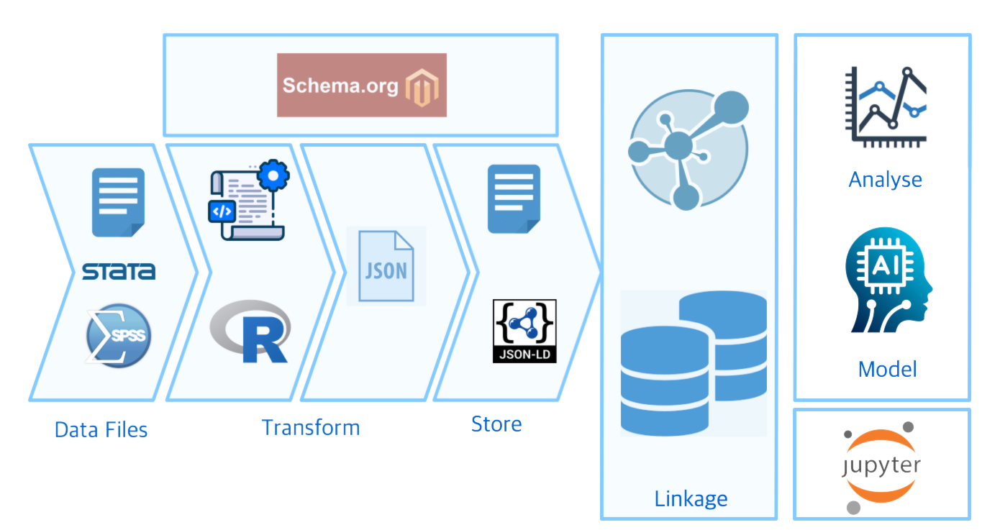

# TSA-ML

TSA-ML is a data pipeline that integrates survey data from diverse sources. This piece of work demostrates my interest in using machine learning and data science in  the region. More information about this work is on the [official website](https://www.tsa-ml.org).

---



TSA-ML is a data pipeline that...

* **Transforms and ingest** microeconomic data from surveys drawn from diverse sources, mainly in the East-Asia region. It provides granular data at the level of the individual which allows powerful analytics and predictions.

* **Links** different sources using Resource Description Framework (RDF) and SPARQL W3C standards. Data is stored in a graph database, and data is interconnected using the Schema.org vocabulary.

* **Automates** the data preprocessing phase using Natural Language Processing (NLP), machine learning, and AI.

## Public datasets

Below is a list of the datasets currently used in the system.

| Region | Source | Owner | Description | Link
|:------|:-----------------|:--------------|:----------------------------------|:--------------|
| Taiwan |  Taiwan Social Change Survey (TSCS) | Center for Survey Research, Academia Sinica | A longitutindal dataset containing survey data on different social topics such as employment, family, and social networks. The TSCS contains data from the 1980's from individuals and families across Taiwan. | [Link](https://www2.ios.sinica.edu.tw/sc/en/home2.php)
| Taiwan |  World Values Survey (WVS) | Research Center for Humanities and Social Sciences, Academia Sinica, Taipei | Social surveys conducted in 2019, 2012, 2006, and 1998 | [Link](https://www.worldvaluessurvey.org/WVSDocumentationWV7.jsp) 
| Hong Kong |  World Values Survey (WVS) | Department of Government and International Studies, Hong Kong Baptist University | Social surveys conducted in 2018, 2014, and 2005 | [Link](https://www.worldvaluessurvey.org/WVSDocumentationWV7.jsp)
| Macao | World Values Survey (WVS) | Faculty of Social Sciences, Avenida da Universidade | Social surveys conducted in 2019 | [Link](https://www.worldvaluessurvey.org/WVSDocumentationWV7.jsp)
| China |  World Values Survey (WVS) | Public Opinion Research Center of School of International and Public Affairs at Shanghai Jiao Tong University | Social surveys conducted in 2018, 2013, 2007, 2001, 1995, and 1990 | [Link](https://www.worldvaluessurvey.org/WVSDocumentationWV7.jsp)

Please contact us if you want to contribute a dataset. Refer to the below details.

## Quick Start

### Requirements and Installation

Need to install the following in your environment:

* Python 3.9.6
* R version 4.2.3
* Docker 4.19.0
* AllegroGraph 7

### What is in this repository?

This repository contains the following:

* JSON-LD ingestion files for graph database (`./ingestion/`).
* Landing web page for this work.
* Python script for loading JSON-LD ingestion files (`ingest_json.py`).
* Jupyter notes containing tutorials and use cases (`.ipynb` files).

### Setup graph database

Install and activate virtual environment for TSA-ML graph database.

```
$ python3 -m venv tsaml
$ source tsaml/bin/activate
```

Install python libraries for AllegroGraph database. 

```
$ pip3 install agraph-python
```

Start up AllegroGraph database instance using Docker.

```
$ docker start agraph
```

To stop AllgegroGraph database instance using Docker.

```
$ docker stop agraph
```

## Data Ingestion

### Uploading the data in the graph database

Graph database can ingest TSA-ML data in various ways. Data files can be manually moved or copy into the directory which contains the AllegroGraph installation on a local or remote machine. If a copy of the directory contains the data files of a specific data repository, then it can be copied and paste from the command prompt. Go into Docker then under `Containers` > `agraph` > `Files`. Under the `agraph` folder in the file explorer, drill down to `data` > `rootcatalog` > [database repository name]. This directory contains all of the TSA-ML files and subfolders. All contents of can be managed using the file explorer in Docker app. 

Data can also be ingested using the python script via command prompt. Note, in the `ingest_json.py`, a string variable called `pwd_ingest` can be set to the directory which contains the json files, in this case, it is `./ingestion`.

```
$ python3 ./ingest_json.py
```

Data processing can take some time, as there are 2,395,151 statements. If the script is running on a local machine, it may stall or interrupt occasionally. In this instance, re-run the script using the above command.

### Testing data

The curl command accesses the endpoint which will return all triples in the graph database. Enter the details of your service between sqaure brackets.

```
$ curl -v -X POST -u [user name]:[password] --data "query=SELECT ?s ?p ?o { ?s ?p ?o . }"
  http://[host]:[port number]/repositories/[name of the repository]/sparql
```
## Tutorials and Use Cases

### SPARQL 

[SPARQL Queries](./SPARQL%20Queries%20-%20Use%20Cases.ipynb) tutorials and use cases demostrates different SPARQL queries which addresses research questions using the TSA-ML data platform. 

### Data Profiling 

### Occupation 

Tutorials using Time Series on Occupation Data demostrates how TSA-ML can be used to address research questions relating to the population's key demographics over time. This tutorial demostrates the use of different SPARQL queries, machine learning, and AI using Python. 

Tutorials using Bivariate Analysis on Age and Occupation  demostrates how TSA-ML can be used to perform a bivariate anlysis on the population's age and occupation. This tutorial demostrates the use of different SPARQL queries, machine learning, and AI using Python. 

## Contact

Please email your questions or comments to (d01520417@gmail.com).

## Contributing

Thanks for your interest in contributing! There are many ways to get involved; start by sending us an email to email address listed above or access more information on our [official website](https://www.tsa-ml.org).
